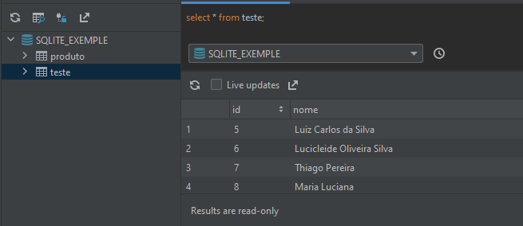

<h1 align="center"> SQLite com Flutter</h1>

 Um pouco de SQLite

 > SOBRE O MÓDULO:
- O objetivo dessa atividade foi conhecer como funciona o SQLite dentro do flutter e como implementa-lo.

- Packages: 
    > <b>SQfLite</b>: Utilizado o pacote para utilizar a extrutura de banco de dados embarcado no aplicativo, pacote disponível [aqui](https://pub.dev/packages?q=sqflite). 

    > <b>Path</b>: O pacote faz a manipulação do caminho de acesso ao banco de multiplataformas, de modo que os diferentes separadores de caminhos sejam identificados automáticamente, para mais detalhes sobre o pacote, clique [aqui](https://pub.dev/packages/path).
- Criando extrutra de código para o versionamento do banco;
- Criando tabelas;

- Fazendo acesso ao banco:
    > Insert: Inserindo dados;

    > Delete: Eliminando dados;

    > Update: Atualizando os dados;

    > Select: Visualizando todos os dados do banco;

### Autor

